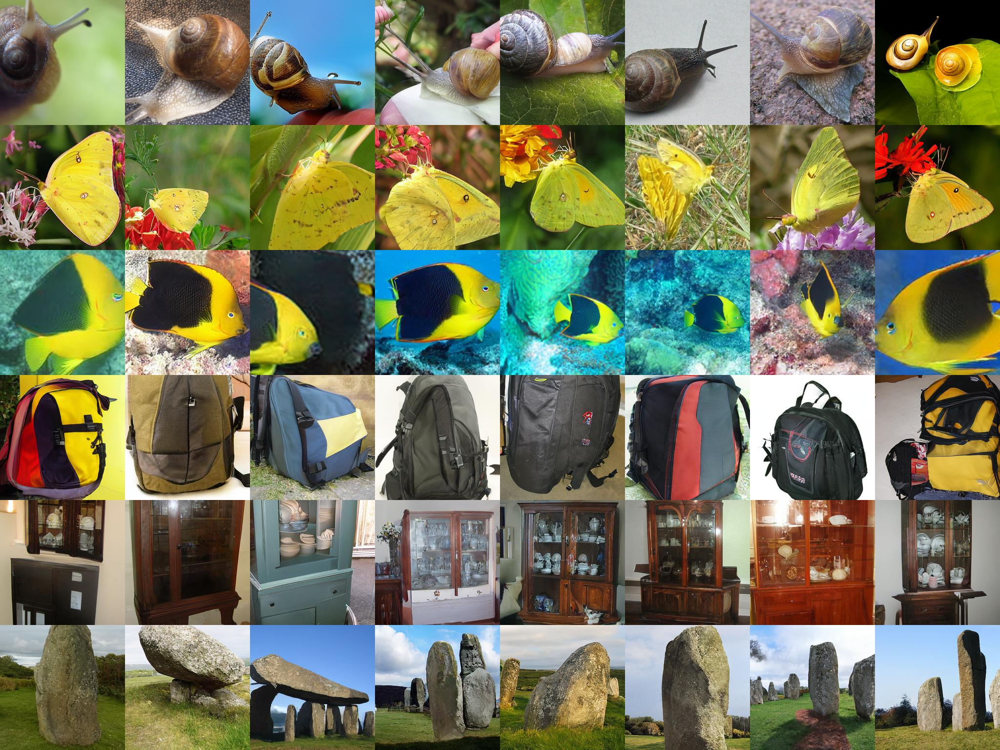

<div align="center">

#  *VAR-CLIP*:<br> Text-to-Image Generator with Visual Auto-Regressive Modeling
[](https://arxiv.org/abs/2408.01181)&nbsp;
</div>

<p align="center">

<p>

> [**VAR-CLIP: Text-to-Image Generator with Visual Auto-Regressive Modeling**](https://arxiv.org/abs/2408.01181)<br>
> Qian Zhang, [Xiangzi Dai](https://github.com/daixiangzi), Ninghua Yang, [Xiang An](https://github.com/anxiangsir), Ziyong Feng, Xingyu Ren
> <br>Institute of Applied Physics and Computational Mathematics, DeepGlint,Shanghai Jiao Tong University<
> 
## Some example for text-conditional generation:
 . 

## Some example for class-conditional generation:
 .

### TODO 
- [ ] Relase train code today.
- [x] Relased Arxiv.
- [x] Training T2I on the ImageNet dataset has been completed.
- [x] Training on the ImageNet dataset has been completed.
## Training Scripts
The relevant train code will be released soon, please stay tuned~ . 
```shell
#training VAR-d16 for 200 epochs on ImageNet 256x256 costs 3.5 days on 16 A100s  
CUDA_VISIBLE_DEVICES=0,1,2,3,4,5,6,7 torchrun --nproc_per_node=8 --nnodes=1 --node_rank=0 --master_addr=127.0.0.1 --master_port=12356 train.py  --data_path=/dataset/imagenet/imagenet  --depth=16 --bs=768 --ep=200 --fp16=1 --alng=1e-3 --wpe=0.1
```
## License
This project is licensed under the MIT License - see the [LICENSE](LICENSE) file for details.

## Citations

```bibtex
@misc{unpublished2021clip,
    title  = {CLIP: Connecting Text and Images},
    author = {Alec Radford, Ilya Sutskever, Jong Wook Kim, Gretchen Krueger, Sandhini Agarwal},
    year   = {2021}
}
```
```bibtex
@Article{VAR,
      title={Visual Autoregressive Modeling: Scalable Image Generation via Next-Scale Prediction}, 
      author={Keyu Tian and Yi Jiang and Zehuan Yuan and Bingyue Peng and Liwei Wang},
      year={2024},
      eprint={2404.02905},
      archivePrefix={arXiv},
      primaryClass={cs.CV}
}
```
* VAR - https://github.com/FoundationVision/VAR
* CLIP - https://github.com/openai/CLIP
